# Simple To-Do List Installation
First and foremost, make sure XAMPP with correct versions of required components is installed:
> PHP Version 7.3.33

> Phalcon 3.4

If version of any component differs, you may get multiple errors and unfunctional program in return.

## Getting Started
When cloning program folder, make sure to name it _todo_, then place it to your '/xampp/htdocs/' directory.

## Creating required database and table
Code assumes, that database name is _todos_. If you'd like your database name to be different, change said name to your liking in all queries and proceed to '/public/index.php' and change database name to the one you chose.

Also make sure database details (such as host and user names, password AND database name) correspond to the ones in your configuration and match with '/public/index.php' settings.

<details><summary><b>Show Instructions</b></summary>
Starting on line 60 of '/public/index.php' is the database adapter service where all the accessibility credentials are mentioned.

<kbd>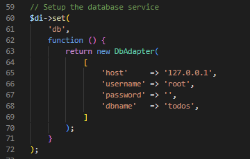</kbd>
> If you choose to have different credentials, make sure to have them changed here.
</details>


In phpmyadmin, insert following SQL statement:
```
'CREATE DATABASE todos;'
```

Then, in 'todos' database insert following SQL statement:
```
CREATE TABLE `tasks`
(
    `id`    int unsigned NOT NULL AUTO_INCREMENT,
    `task`  varchar(255) NOT NULL,
    `status` tinyint(1) DEFAULT 0,
    PRIMARY KEY (`id`)
);
```

After all these manipulations, launching and starting XAMPPs' Apache should run the program. Accessing IP address (localhost) and port should lead you to the main page of the program.
<kbd>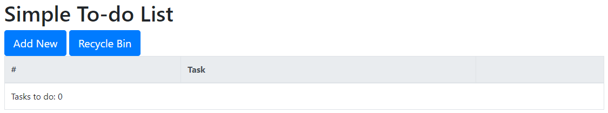</kbd>


## Usage and Functionality
First thing you see when you open up the webpage are 2 buttons, which do exactly what their name states.
<kbd>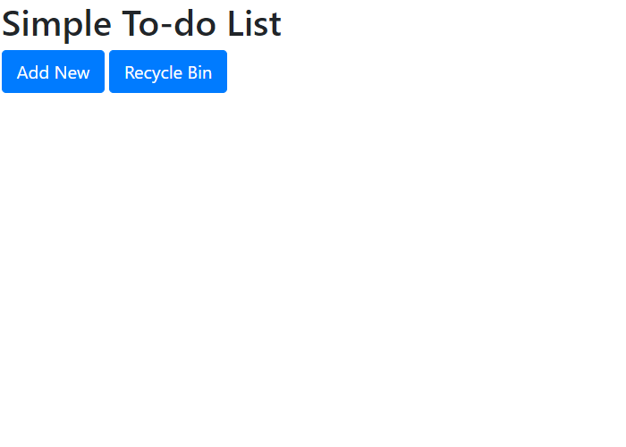</kbd>

Most logical thing to do would be to add a new task by clicking _Add Task_ button, which will redirect you to corresponding action form.
<kbd>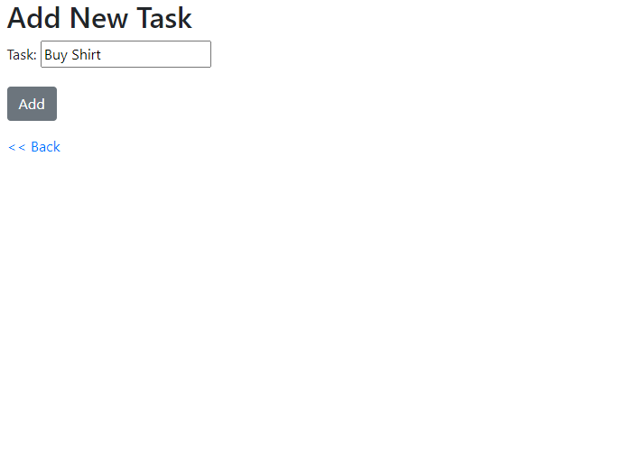</kbd>
> Clicking add will insert specified task to the database and assign a serial id to it (last one serves as a tool for lookup within logic of the program and may techically be hidden from regular user).

Upon confirming action with _Add_ button you will still be redirected to the same page, assuming you would want to add multiple tasks in the same session. The _Back_ button will return you to the main page, where freshly added task awaits us.

<kbd>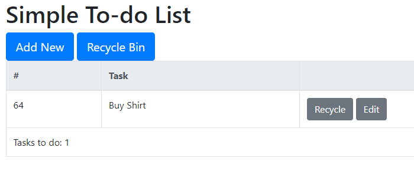</kbd>

From here you have 2 ways of managing a task:
- Recycle - assumes you are probably done with the task and will move it to recycle bin.
- Edit - assumes you made a typo of some sort and want to edit the task.

Clicking _Edit_ will redirect you to corresponding action form.
<kbd>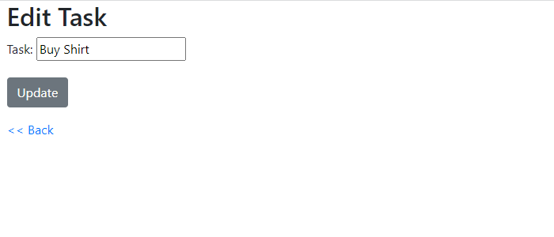</kbd>

Inserting a different name and confirming it with _Update_ button will return you to the main page only to see your task has been edited.

<kbd>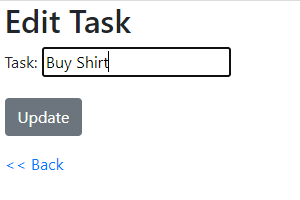 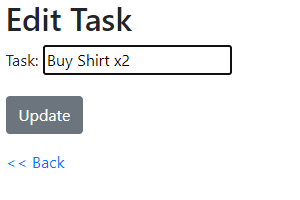</kbd>

<kbd>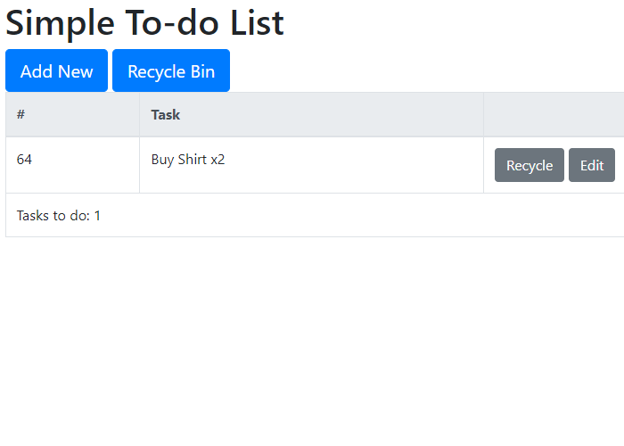</kbd>

Clicking _Recycle_ will immediately move the task to recycle bin.

To go to Recycle Bin, click corresponding button at the upper part of the page. If you have any recycled tasks they will appear there.
<kbd>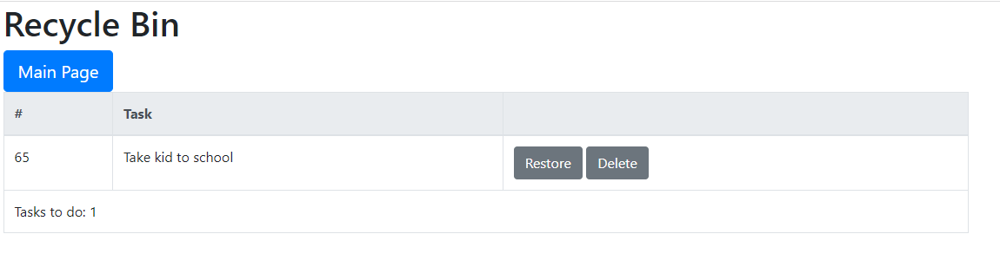</kbd>

2 action buttons next to recycled task do exactly what they say:
- Restore - restores a task back to the tasklist
- Delete - deletes a task forever. There's no way to restore it.

Clicking _Restore_ will redirect you to the same page to see the task you restored is now absent from Recycle Bin.
Clicking _Main Page_ will redirect you back to Main Page and restored task will be back on the list.
<kbd>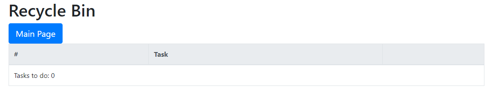</kbd>

<kbd>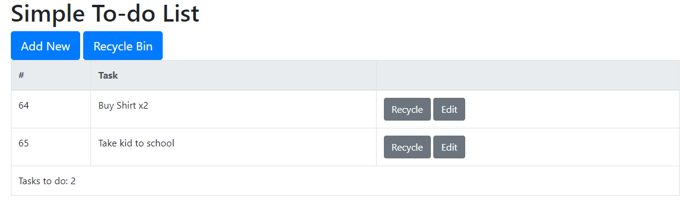</kbd>
